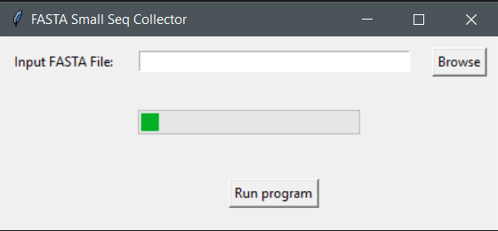

# FASTA-Small-Seq-Collector

A FAST Windows GUI app that collects sequences with length <= 300 for effectome analysis

## Dependencies

1. Windows 11 or 10 version 16215.0 or higher(type `winver` on the search button and click `winver` to find your OS version)
2. [Windows Subsystem for linux(wsl1)](INSTALL.md)
3. the file in the `bin` folder

## Usage 

Click on the `FASTA Small Seq Collector.exe` file

Click `browse` and select an input file

Click `Run program`

The example input/output files can be seen [here](data/ITAG4.1_proteins.fasta) and [here](data/ITAG4.1_proteins_small_seqs.fasta) respectively
